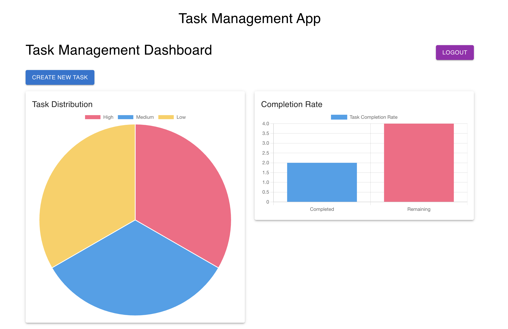
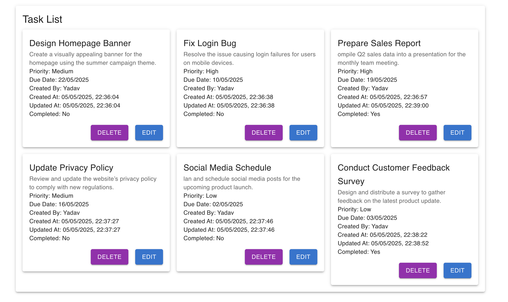

# Task Management Application

A task management system that allows users to create, update, manage, and track tasks efficiently, featuring task analytics like priority distribution, completion rates, and upcoming deadlines.

## Features

### Task Management
- **CRUD Operations**: Create, Read, Update, and Delete tasks.
- **Priority Levels**: Set task priority (Low, Medium, High).
- **Due Dates**: Assign due dates for tasks.
- **Completion Status**: Mark tasks as completed or pending.

### Task Analytics
- **Task Distribution by Priority**: Visual representation of tasks categorized by priority levels using charts.
- **Task Completion Rate**: A progress bar displaying the percentage of completed tasks.
- **Upcoming Deadlines**: List or calendar view of tasks nearing their due dates.

### User Authentication
- **Register**: Create a new account with email, username, and password.
- **Login**: Authenticate using email and password.
- **Logout**: Securely log out and clear session cookies.

### Responsive User Interface
- Built using **Material-UI** for a sleek and modern design.
- **Responsive Layout**: Adapts across devices for optimal viewing.

### Dashboard
- Comprehensive view of all analytics and tasks in one place.
- Clean and user-friendly navigation.

## Technology Stack
- **Frontend**: React, Material-UI
- **Backend**: Node.js, Express
- **Database**: MongoDB

## Screenshots



## Installation Guide

### Prerequisites
- **Node.js** (v22.x or later)
- **MongoDB** (Running locally or via a cloud instance like MongoDB Atlas)

### Steps to Install and Run the Project

#### 1. Clone the Repository
```bash
git clone https://github.com/aaffriya/task-app.git
cd task-app
```

#### 2. Install Dependencies
Navigate to the root project folder and install dependencies for both the backend and frontend:
```bash
# Backend
cd backend
npm install

# Frontend
cd ../frontend
npm install
```

#### 3. Backend Configuration
Navigate to the backend directory:
```bash
cd backend
```
Update the existing `.env` file in the backend directory with your MongoDB connection string.

#### 4. Start the Backend Server
```bash
npm start
```
The backend server will run on `http://localhost:8000` (default port, can be changed in the `.env` file).

#### 5. Start the Frontend Server
Navigate to the frontend directory:
```bash
cd ../frontend
npm start
```
The React frontend server will run on `http://localhost:3000`. The application should now be fully functional!

## Environment Variables
The following environment variables are required for the backend:
- `PORT`: The port on which the backend server runs (default: `8000`).
- `MONGO_URI`: Your MongoDB connection string (e.g., `mongodb://localhost:27017/task_management`).
- `JWT_SECRET`: A secret key for signing JSON Web Tokens.

## API Endpoints
Here’s a list of the main API endpoints used by the application:

### Authentication
- `POST /api/register`: Register a new user.
- `POST /api/login`: Log in an existing user.
- `POST /api/logout`: Log out the current user.

### Task Management
- `GET /api/tasks`: Fetch all tasks.
- `POST /api/tasks`: Create a new task.
- `PUT /api/tasks/:id`: Update a specific task.
- `DELETE /api/tasks/:id`: Delete a specific task.
- `GET /api/tasks/:id`: Fetch a specific task by ID.

## Project Structure
```
task-management-app/
│
├── backend/               # Node.js/Express backend
│   ├── models/            # Mongoose models (Task.js, User.js)
│   ├── routes/            # Express routes for task and authentication APIs
│   ├── middlewares/       # Authentication middleware
│   ├── server.js          # Entry point for backend
│   └── .env               # Environment variables (e.g., MongoDB URI)
│
├── frontend/              # React frontend
│   ├── public/            # Static assets
│   ├── src/               # React source files
│   │   ├── components/    # Reusable React components (TaskForm, TaskList, etc.)
│   │   ├── App.js         # Main App component
│   │   ├── index.js       # Entry point for React app
│   └── package.json       # Frontend dependencies and scripts
│
├── docker-compose.yml     # Docker Compose configuration for frontend, backend, and database
└── README.md              # Project documentation
```

